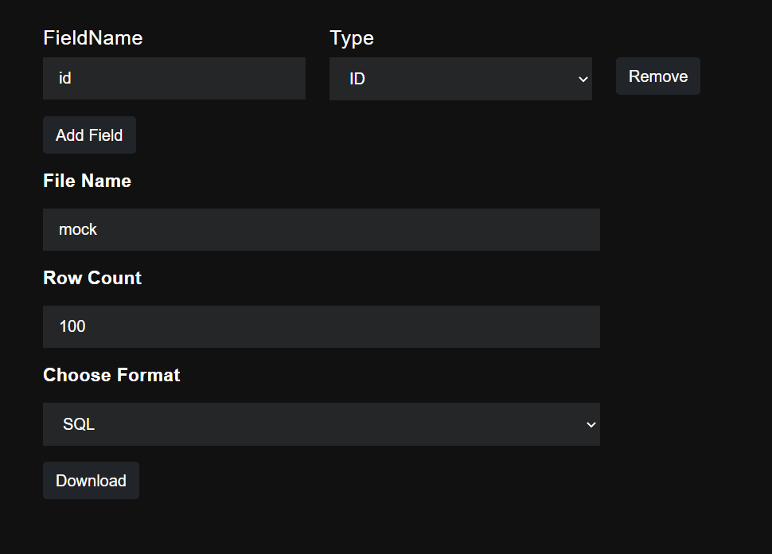

# MockDataGenerator

API that can generate up to 1 million data, according to any table. 
Data generation will be much faster using the updated version.
Once the data is generated, the API can retrieve it once.

## GInterface
